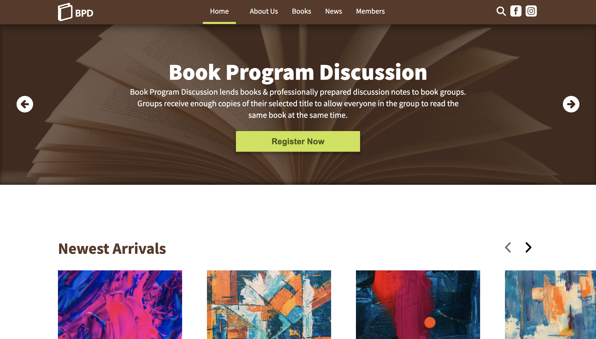
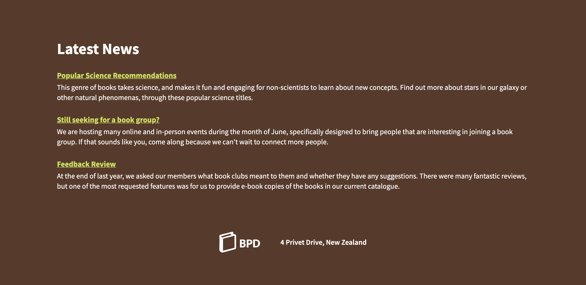
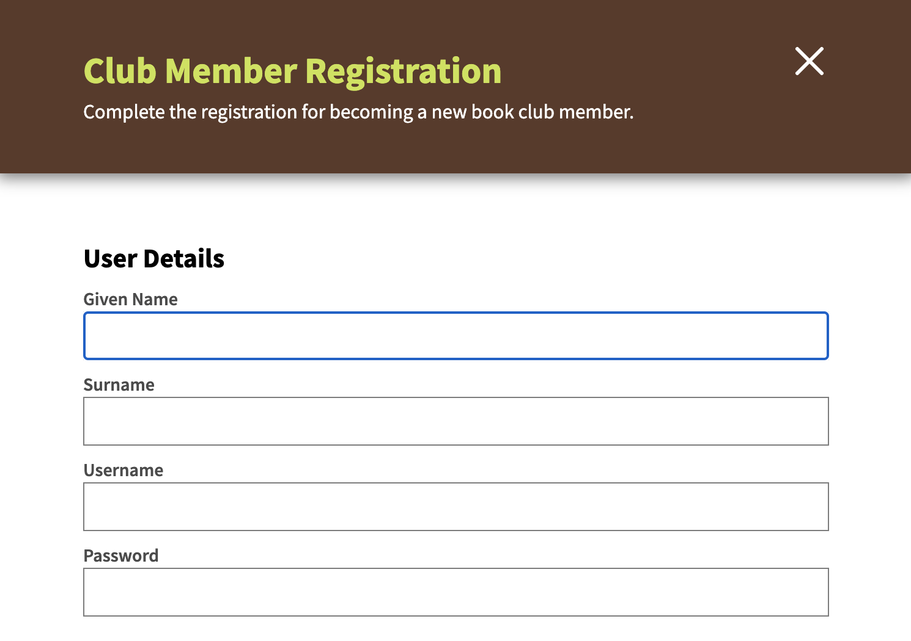

# Book Program Discussion

Assignment for SOFTENG 350 - Human Computer Interaction.

The assignment was to create a homepage for the Book Program Discussion club, using the heuristics learnt throughout the course. The task was to improve user accessibility by considering contrast ratios between elements, inserting alternative texts for images etc. My assigned background color was ```#5B3A29``` (dark brown).

## Screenshots







## Set Up

There is no setup required for this project. Simply launch the website by opening ```index.html``` in your browser.
